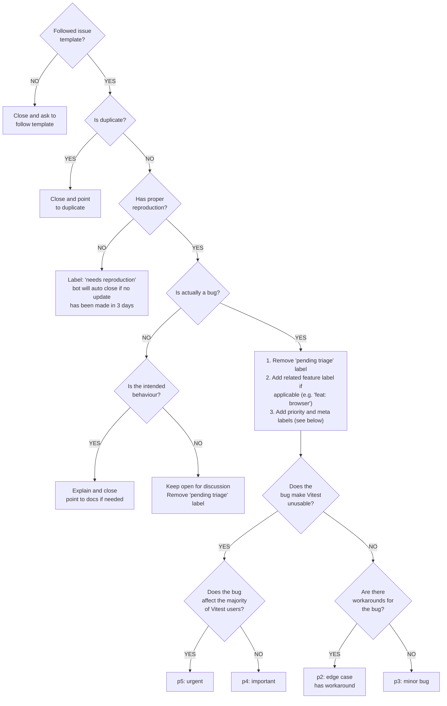
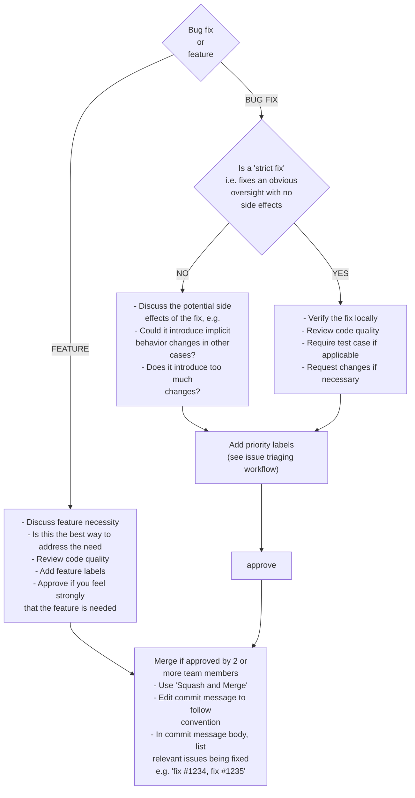

# Vitest Contributing Guide

Hi! We are really excited that you are interested in contributing to Vitest. Before submitting your contribution, please make sure to take a moment and read through the following guide:

## Repo Setup

The Vitest repo is a monorepo using pnpm workspaces. The package manager used to install and link dependencies must be [pnpm](https://pnpm.io/).

We recommend installing [ni](https://github.com/antfu/ni) to help switching between repos using different package managers. `ni` also provides the handy `nr` command which running npm scripts easier:

- `ni` is equivalent to `pnpm install`
- `nr test` is equivalent to `pnpm run test`

To develop and test `vitest` package:

1. Run `pnpm install` in `vitest`'s root folder

2. Run `pnpm run build` to build all monorepo packages
  - after this, you can use `pnpm run dev` to rebuild packages as you modify code

3. Run
   - `pnpm run test` to run core tests
   - `pnpm run test:ci` to run all the suite
   - `cd test/(dir) && pnpm run test` to run a specific test suite

> 💡 If you use VS Code, you can hit `⇧ ⌘ B` or `Ctrl + Shift + B` to launch all the necessary dev tasks.

## Debugging

### VS Code

If you want to use break point and explore code execution you can use the ["Run and debug"](https://code.visualstudio.com/docs/editor/debugging) feature from vscode.

1. Add a `debugger` statement where you want to stop the code execution.

2. Click on the "Run and Debug" icon in the activity bar of the editor.

3. Click on the "Javascript Debug Terminal" button.

4. It will open a terminal, then type the test command: `pnpm run test`

5. The execution will stop and you'll use the [Debug toolbar](https://code.visualstudio.com/docs/editor/debugging#_debug-actions) to continue, step over, restart the process...

## Testing Vitest against external packages

You may wish to test your locally-modified copy of Vitest against another package that is using it. For pnpm, after building Vitest, you can use [`pnpm.overrides`](https://pnpm.io/package_json#pnpmoverrides). Please note that `pnpm.overrides` must be specified in the root `package.json` and you must first list the package as a dependency in the root `package.json`:

```json
{
  "dependencies": {
    "vitest": "*"
  },
  "pnpm": {
    "overrides": {
      "vitest": "link:../path/to/vitest/packages/vitest"
    }
  }
}
```

And re-run `pnpm install` to link the package.

Add a `.npmrc` file with following line next to the `package.json`:

```sh
VITE_NODE_DEPS_MODULE_DIRECTORIES=/node_modules/,/packages/
```

## Pull Request Guidelines

- Checkout a topic branch from a base branch, e.g. `main`, and merge back against that branch.

- If adding a new feature:

  - Add accompanying test case.
  - Provide a convincing reason to add this feature. Ideally, you should open a suggestion issue first and have it approved before working on it.

- If fixing bug:

  - If you are resolving a special issue, add `(fix #xxxx[,#xxxx])` (#xxxx is the issue id) in your PR title for a better release log, e.g. `fix: update entities encoding/decoding (fix #3899)`.
  - Provide a detailed description of the bug in the PR. Live demo preferred.
  - Add appropriate test coverage if applicable.

- It's OK to have multiple small commits as you work on the PR - GitHub can automatically squash them before merging.

- Make sure tests pass!

- Commit messages must follow the [commit message convention](./.github/commit-convention.md) so that changelogs can be automatically generated.

- Use `pnpm run lint:fix` to format files according to the project guidelines.

## Maintenance Guidelines

> The following section is mostly for maintainers who have commit access, but it's helpful to go through if you intend to make non-trivial contributions to the codebase.

### Issue Triaging Workflow



### Pull Request Review Workflow



## Notes on Dependencies

Vitest aims to be lightweight, and this includes being aware of the number of npm dependencies and their size.

### Think before adding a dependency

Most deps should be added to `devDependencies` even if they are needed at runtime. Some exceptions are:

- Type packages. Example: `@types/*`.
- Deps that cannot be properly bundled due to binary files.
- Deps that ships its own types and its type is used in vitest's own public types.

Avoid deps that has large transitive dependencies that results in bloated size compared to the functionality it provides.

If there are libraries that are needed and don't comply with our size
requirements, a fork can be tried to reduce its size while we work with them to
upstream our changes (see [tinypool](https://github.com/tinylibs/tinypool) for example)

### Think before adding yet another option

We already have many config options, and we should avoid fixing an issue by adding yet another one. Before adding an option, try to think about:

- Whether the problem is really worth addressing
- Whether the problem can be fixed with a smarter default
- Whether the problem has workaround using existing options
- Whether the problem can be addressed with a plugin instead
