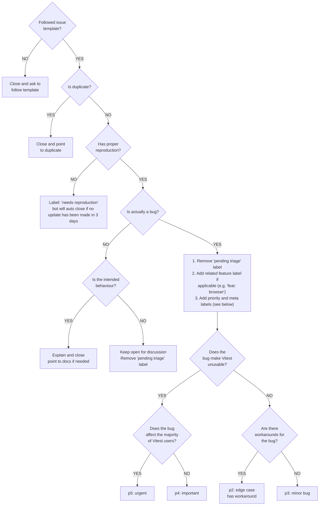
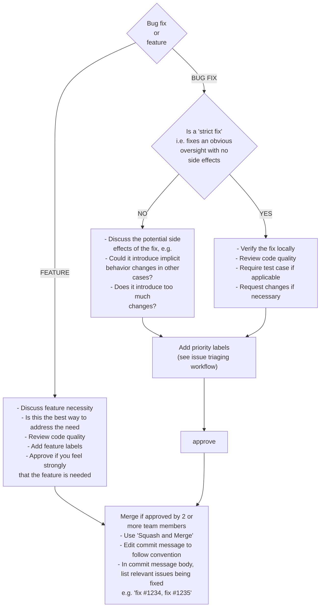

# Vitest Contributing Guide

Hi! We are really excited that you are interested in contributing to Vitest. Before submitting your contribution, please make sure to take a moment and read through the following guide:

## Repo Setup

The Vitest repo is a monorepo using pnpm workspaces. The package manager used to install and link dependencies must be [pnpm](https://pnpm.io/).

We recommend installing [ni](https://github.com/antfu/ni) to help switching between repos using different package managers. `ni` also provides the handy `nr` command which running npm scripts easier:

- `ni` is equivalent to `pnpm install`
- `nr test` is equivalent to `pnpm run test`

To develop and test `vitest` package:

1. Run `pnpm install` in `vitest`'s root folder

2. Run `pnpm run build` to build all monorepo packages
  - after this, you can use `pnpm run dev` to rebuild packages as you modify code

3. Run
   - `pnpm run test` to run core tests
   - `pnpm run test:ci` to run all the suite
   - `cd test/(dir) && pnpm run test` to run a specific test suite

> 💡 If you use VS Code, you can hit `⇧ ⌘ B` or `Ctrl + Shift + B` to launch all the necessary dev tasks.

### UI Development

If you want to improve Vitest Browser Mode, see the [Browser Mode development guide](./packages/ui/README.md) for setup instructions and development workflow.

## Debugging

### VS Code

If you want to use break point and explore code execution you can use the ["Run and debug"](https://code.visualstudio.com/docs/debugtest/debugging) feature from vscode.

1. Add a `debugger` statement where you want to stop the code execution.

2. Click on the "Run and Debug" icon in the activity bar of the editor.

3. Click on the "Javascript Debug Terminal" button.

4. It will open a terminal, then type the test command: `pnpm run test`

5. The execution will stop and you'll use the [Debug toolbar](https://code.visualstudio.com/docs/debugtest/debugging#_debug-actions) to continue, step over, restart the process...

## Testing Vitest against external packages

You may wish to test your locally-modified copy of Vitest against another package that is using it. For pnpm, after building Vitest, you can use [`pnpm.overrides`](https://pnpm.io/9.x/package_json#pnpmoverrides). Please note that `pnpm.overrides` must be specified in the root `package.json` and you must first list the package as a dependency in the root `package.json`:

```json
{
  "dependencies": {
    "vitest": "*"
  },
  "pnpm": {
    "overrides": {
      "vitest": "link:../path/to/vitest/packages/vitest"
    }
  }
}
```

And re-run `pnpm install` to link the package.

Add a `.npmrc` file with following line next to the `package.json`:

```sh
VITEST_MODULE_DIRECTORIES=/node_modules/,/packages/
```

## Using Unreleased Commits

Each commit on the main branch and PRs with a `cr-tracked` label are published to [pkg.pr.new](https://github.com/stackblitz-labs/pkg.pr.new). You can install a specific commit with:

```bash
npm i https://pkg.pr.new/vitest@{commit}
```

## Pull Request Guidelines

- Checkout a topic branch from a base branch, e.g. `main`, and merge back against that branch.

- If adding a new feature:

  - Add accompanying test case.
  - Provide a convincing reason to add this feature. Ideally, you should open a suggestion issue first and have it approved before working on it.
  - When adding cli options, run `pnpm -C docs run cli-table` to update the cli-generated.md file

- If fixing bug:

  - If you are resolving a special issue, add `(fix #xxxx[,#xxxx])` (#xxxx is the issue id) in your PR title for a better release log, e.g. `fix: update entities encoding/decoding (fix #3899)`.
  - Provide a detailed description of the bug in the PR. Live demo preferred.
  - Add appropriate test coverage if applicable.

- It's OK to have multiple small commits as you work on the PR - GitHub can automatically squash them before merging.

- Make sure tests pass!

- Commit messages must follow the [commit message convention](./.github/commit-convention.md) so that changelogs can be automatically generated.

- Use `pnpm run lint:fix` to format files according to the project guidelines.

## AI Contributions

The team welcomes the use of AI as a personal assistant when contributing to Vitest. However, we strongly believe that a real person must be behind every issue and pull request. The code itself is not the most important part; if it were, the team would have automated everything already, which is far easier to manage than coordinating with random AI agents.

All issues and pull requests must be opened by a real person using the official templates. If AI assisted in creating a pull request, please disclose the tool used (e.g. Claude, Codex, Copilot).

Pull requests or issues entirely generated by AI with no human involvement (e.g. by an automated agent) will be labeled "maybe automated" by the maintainers and closed automatically after 3 days unless a real person responds. The response is expected to be genuine, meaning it should not be written by an LLM. The maintainers reserve the right to decide, based on their experience, whether a response was AI-generated.

AI-generated comments on issues, pull requests, or discussions that add no value or contain incorrect information will be hidden by the maintainers.

These measures help reduce maintenance burden and keep the team's work efficient.

## Maintenance Guidelines

> The following section is mostly for maintainers who have commit access, but it's helpful to go through if you intend to make non-trivial contributions to the codebase.

### Release Branches

Public support ranges are documented in [Releases](./docs/releases.md). This section describes how maintainers map those ranges to Git branches for releases and backports. These names refer to branches, not release tags; release tags always include the full version, for example `v4.1.8`.

- `main` is the active development branch for the next release line.
- `vN` is the latest maintained minor line for non-main major version `N`.
- `vN.M` is an older minor line for major version `N`, kept when that exact minor still needs releases or backports.

As a hypothetical example, if `v5.1.2` is the latest Vitest release, and the latest releases for older majors are `v4.1.7` and `v3.2.4`, the branch shape can be:

- `main` is the active development branch for `5.1.x`.
- `v5.0` is an older minor line for Vitest 5.
- `v4` is the latest maintained minor line for Vitest 4, so it is the `4.1.x` line.
- `v4.0` is an older minor line for Vitest 4.
- `v3` is the latest maintained minor line for Vitest 3, so it is the `3.2.x` line.
- `v3.1` and `v3.0` are older minor lines for Vitest 3.

The `v5` branch does not exist yet. It will be created from the latest v5 minor only after `main` moves on to a newer release line, such as `6.0.0` or often `6.0.0-beta.x`.

For backports, first use the public support policy to decide which version ranges are supported, then map them to branches:

- Changes can land as usual on the `main` branch first.
- If the fix targets the latest maintained minor of major version `N`, target `vN`. This is the default backport target for a supported non-main major.
- If the fix also needs an older maintained minor `N.M`, target `vN.M`.

For example, using the hypothetical `v5.1.2` release above, the public support policy covers regular fixes for `5.1.x` and important fixes or security patches for `5.0.x` and `4.1.x`:

- fixes for `5.1.x` target `main`
- backports to `5.0.x` target `v5.0`
- backports to `4.1.x` target `v4`

No backport is made to `v3` unless the support policy changes or maintainers decide on an explicit exception.

Backport PR titles should include the target branch in a `[backport to x]` marker, for example `fix: [backport to v5.0] ...` or `fix: [backport to v4] ...`. Branch names never include patch versions.

#### Documentation Branches

The release branches are also linked with the documentation site releases:

- `main` is the source for unreleased documentation at <https://main.vitest.dev/>.
- `release` points to the latest stable release line used for <https://vitest.dev/>. Release managers update it manually for non-beta releases from `main`; it is not moved for older-line backports.
- `vN` branches are used for old major documentation sites. For example, <https://v3.vitest.dev/> uses `v3`.

### Release process

Releases — publishing the npm packages, creating the git release tag, and generating the associated GitHub release — are driven by a pull request and carried out by GitHub Actions, not from a maintainer's machine. The release PR holds the version bump, and merging it kicks off the actual publish.

1. **Prepare the release PR.** Run the `Prepare Publish` workflow, setting the `target_branch` input to the branch that matches the [release branch](#release-branches) convention for the release line, then choose the `release` or `version` input to control the version bump. The default input is `release: next`, which bumps the version to the next patch version for stable releases (e.g. `4.1.2 -> 4.1.3`), or the next prerelease version when the current version is already a prerelease (e.g. `4.2.0-beta.2 -> 4.2.0-beta.3`). Use `release: conventional` to derive the bump from the commit history, set `release` to a specific bump type, or pass an exact `version` for pre-releases. To preview the version a given `release` input resolves to, you can run `pnpm release` locally first — it lists the commits since the last release and lets you browse available release types and versions interactively (cancel before confirming so nothing is committed). The workflow pushes the version bump to a branch and prints a compare URL; open that URL to create the release PR.

2. **Review and merge.** Review the version bump, then merge the PR so the `chore: release v*` commit lands on the release branch — that commit is what triggers the Publish step.

3. **Publish.** The release commit starts the `Publish Package` workflow, which pauses for a maintainer to approve the `Release` environment. Once approved, it builds and publishes the packages to npm, pushes the release tag, and generates the GitHub release. Approve when prompted, then confirm npm, the tag, and the GitHub release all look right.

### Issue Triaging Workflow


```mermaid
flowchart TD
    start{Followed issue<br/>template?}
    start --NO--> close1[Close and ask to<br/>follow template]
    start --YES--> dupe{Is duplicate?}
    dupe --YES--> close2[Close and point<br/>to duplicate]
    dupe --NO--> repro{Has proper<br/>reproduction?}
    repro --NO--> close3[Label: 'needs reproduction'<br/>bot will auto close if no update has been made in 3 days]
    repro --YES--> real{Is actually a bug?}
    real --NO--> intended{Is the intended<br/>behaviour?}
    intended --YES--> explain[Explain and close<br/>point to docs if needed]
    intended --NO--> open[Keep open for discussion<br/>Remove 'pending triage' label]
    real --YES--> real2["1. Remove 'pending triage' label<br/>2. Add related feature label if<br/>applicable (e.g. 'feat: browser')<br/>3. Add priority and meta labels (see below)"]
    real2 --> unusable{Does the<br/>bug make Vitest<br/>unusable?}
    unusable --YES--> maj{Does the bug<br/>affect the majority<br/>of Vitest users?}
    maj --YES--> p5[p5: urgent]
    maj --NO--> p4[p4: important]
    unusable --NO--> workarounds{Are there<br/>workarounds for<br/>the bug?}
    workarounds --YES--> p2[p2: edge case<br/>has workaround]
    workarounds --NO--> p3[p3: minor bug]
```

### Pull Request Review Workflow


```mermaid
flowchart TD
    start{Bug fix<br/>or<br/>feature}
    start --BUG FIX--> strict_bug{"Is a 'strict fix'<br/>i.e. fixes an obvious<br/>oversight with no<br/>side effects"}
    start --FEATURE--> feature[- Discuss feature necessity<br/>- Is this the best way to address the need<br/>- Review code quality<br/>- Add feature labels<br/>- Approve if you feel strongly<br/>that the feature is needed]
    feature --> merge
    strict_bug --YES--> strict[- Verify the fix locally<br/>- Review code quality<br/>- Require test case if applicable<br/>- Request changes if necessary]
    strict_bug --NO--> non_strict[- Discuss the potential side<br/>effects of the fix, e.g.<br/>- Could it introduce implicit<br/>behavior changes in other<br/>cases?<br/>- Does it introduce too much<br/>changes?]
    non_strict --> label["Add priority labels<br/>(see issue triaging workflow)"]
    strict --> label
    label --> approve
    approve --> merge["Merge if approved by 2 or<br/>more team members<br/>- Use 'Squash and Merge'<br/>- Edit commit message to follow convention<br/>- In commit message body, list relevant issues being fixed<br/>e.g. 'fix #1234, fix #1235'"]
```

## Notes on Dependencies

Vitest aims to be lightweight, and this includes being aware of the number of npm dependencies and their size.

### Think before adding a dependency

Most deps should be added to `devDependencies` even if they are needed at runtime. Some exceptions are:

- Type packages. Example: `@types/*`.
- Deps that cannot be properly bundled due to binary files.
- Deps that ships its own types and its type is used in vitest's own public types.

Avoid deps that has large transitive dependencies that results in bloated size compared to the functionality it provides.

If there are libraries that are needed and don't comply with our size
requirements, a fork can be tried to reduce its size while we work with them to
upstream our changes.

### Think before adding yet another option

We already have many config options, and we should avoid fixing an issue by adding yet another one. Before adding an option, try to think about:

- Whether the problem is really worth addressing
- Whether the problem can be fixed with a smarter default
- Whether the problem has workaround using existing options
- Whether the problem can be addressed with a plugin instead
